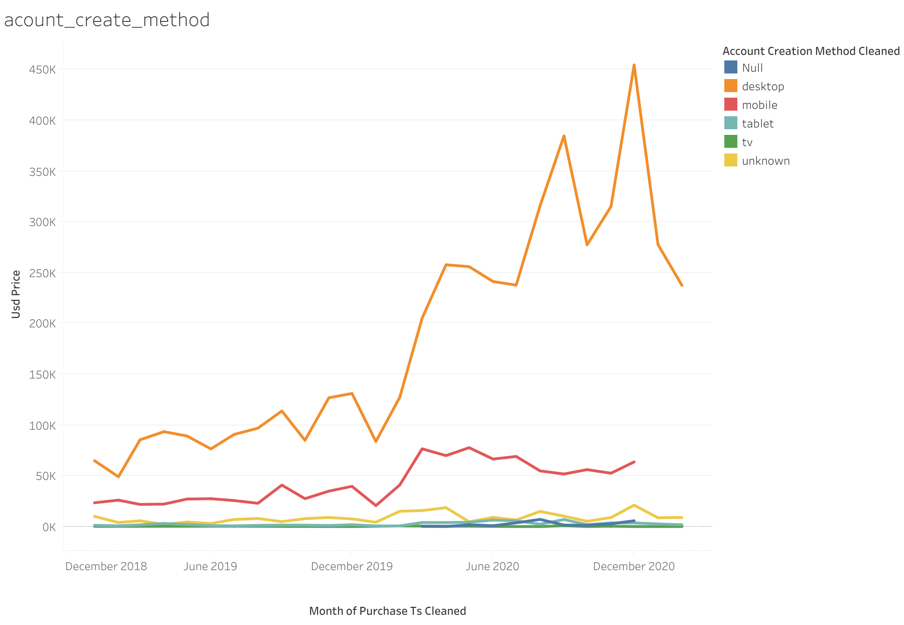
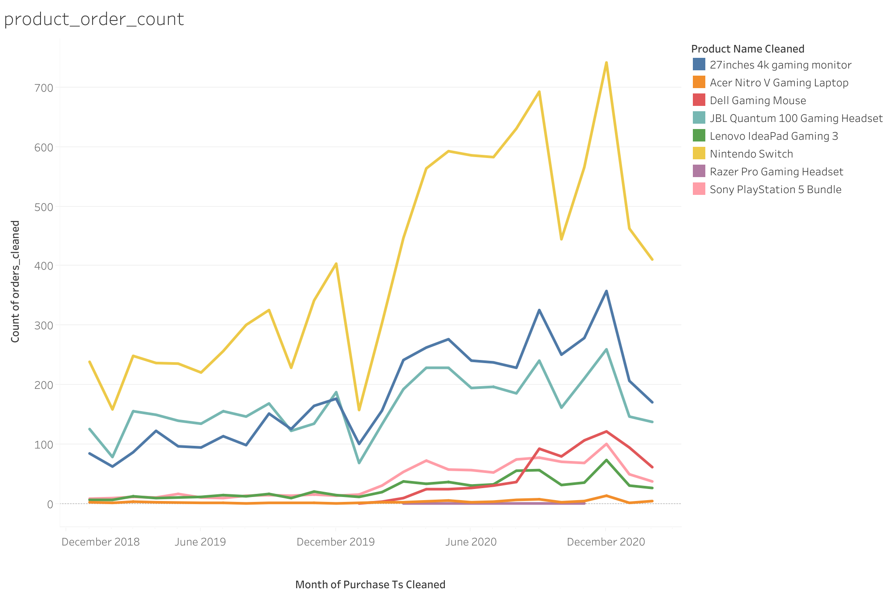
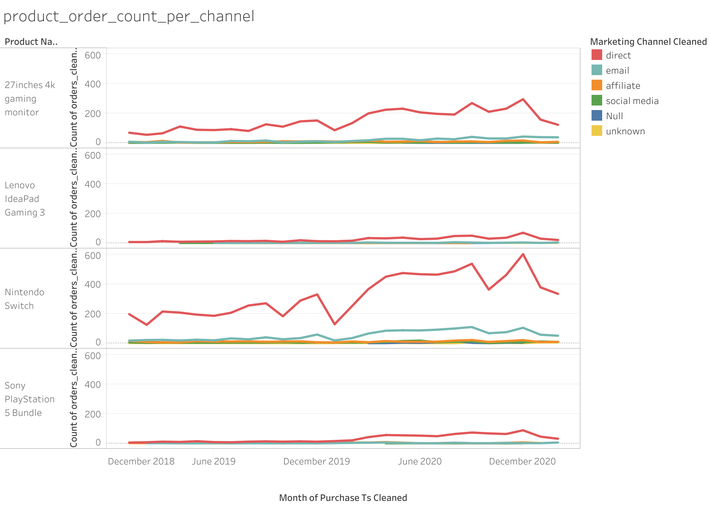
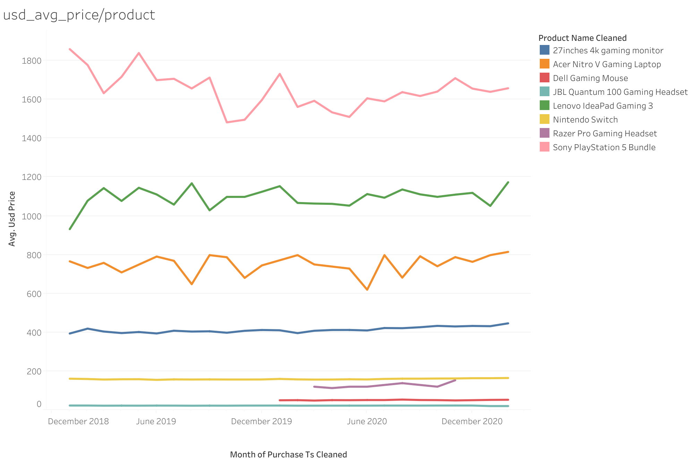
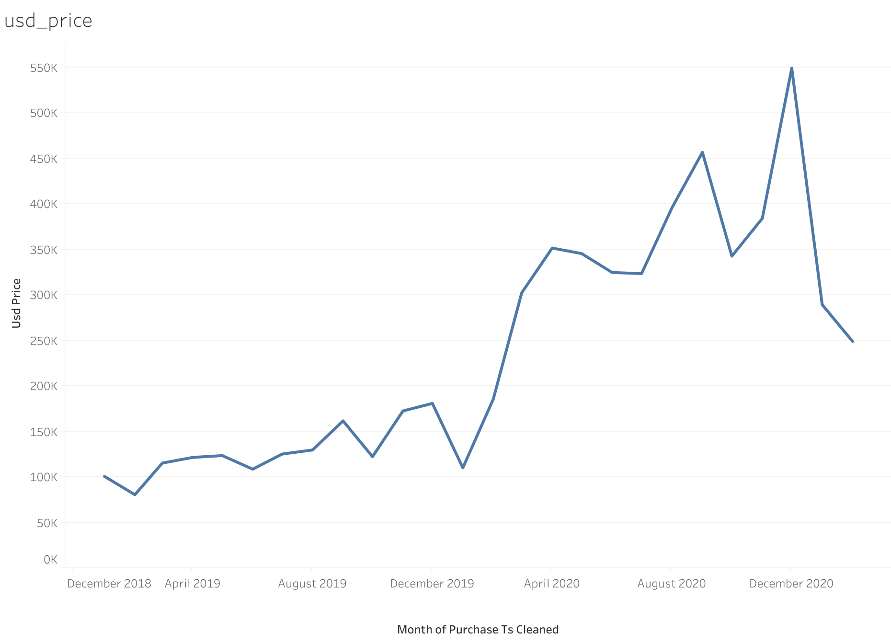
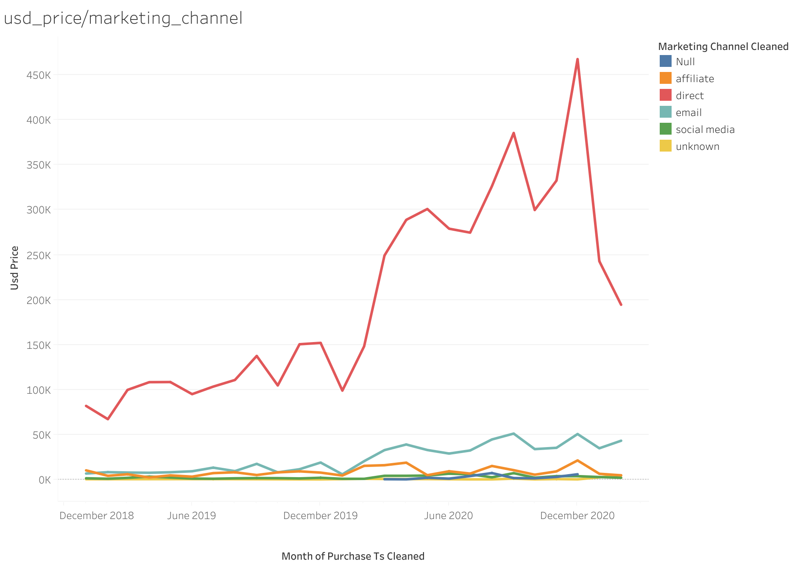
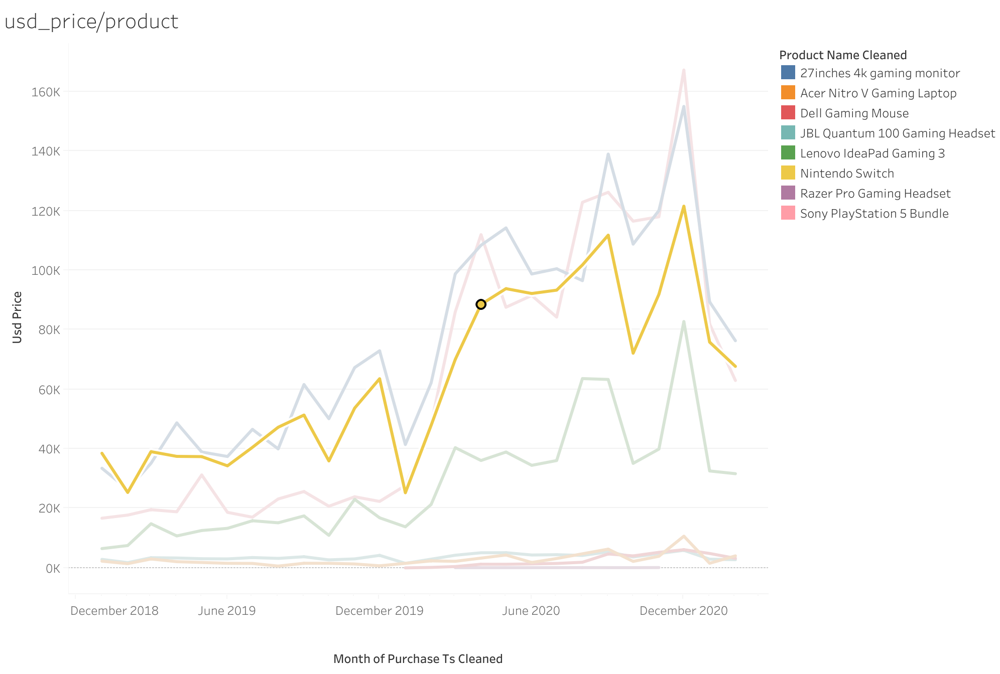

# GameZone Sales Analysis

## Overview

This project analyzes GameZone sales data using Excel Pivot Tables and Tableau dashboards to identify sales trends, customer behavior, and product performance.

The analysis focuses on understanding:

* Revenue distribution across products
* Regional sales performance
* Marketing channel effectiveness
* Customer account creation methods
* Order volume trends

## Tools Used

* Microsoft Excel

  * Data Cleaning
  * Pivot Tables
  * Pivot Charts
* Tableau

  * Dashboard Creation
  * Data Visualization
* Git & GitHub

  * Version Control
  * Project Documentation

## Dataset

The dataset contains customer orders, product information, regions, marketing channels, and pricing data.

Key fields include:

* Product Name
* Order Count
* Marketing Channel
* Region
* USD Price
* Account Creation Method

## Key Insights

### Product Performance

* Compared order volume across products.
* Identified top-performing products based on sales activity.

### Revenue Analysis

* Analyzed product pricing and revenue distribution.
* Examined average selling prices by product category.

### Regional Trends

* Compared sales performance across regions.
* Highlighted regions generating the highest revenue.

### Marketing Channel Analysis

* Evaluated sales contribution by marketing channel.
* Compared order volume and pricing metrics across channels.

### Customer Acquisition

* Analyzed account creation methods to understand customer onboarding preferences.

## Dashboard Screenshots

### Account Creation Method



### Product Order Count



### Product Order Count by Marketing Channel



### Average Product Price



### Product Price Distribution



### Revenue by Region


### Revenue by Marketing Channel



### Revenue by Product



## Repository Structure

```text
data-analysis/
│
├── README.md
├── Tableau_deep_dive/
│   ├── account_create_method.png
│   ├── product_order_count.png
│   ├── product_order_count_per_channel.png
│   ├── usd_avg_price_product.png
│   ├── usd_price.png
│   ├── usd_price_region.png
│   ├── usd_price_marketing_channel.png
│   └── usd_price_product.png
│
├── gamezone-orders-data.xlsx
└── Strategy_manager_dash.pdf
```

## Future Improvements

* Build an interactive Tableau dashboard
* Add KPI summary metrics
* Automate data cleaning with Python
* Perform deeper customer segmentation analysis
